# Aqua-API — Complete Guide & Tutorial

> by AjiroDesu · Fast, friendly REST API playground (canvas memes, random media, AI images)
> with interactive docs and an admin dashboard.

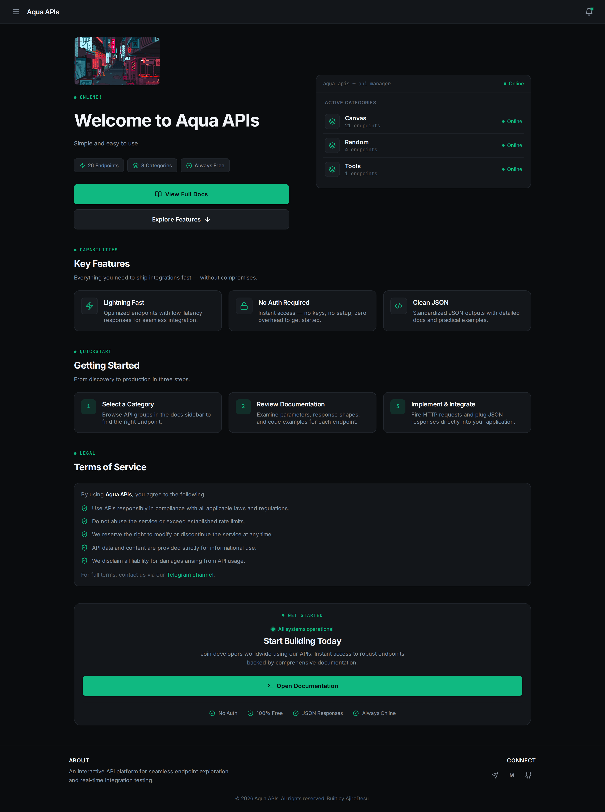

**Live demo:** `https://aqua-api-w6dy.onrender.com` · **Docs:** `/docs` · **Admin:** `/admin`

---

## Table of contents

1. [What you get](#1-what-you-get)
2. [Run it locally](#2-run-it-locally)
3. [Environment variables (full reference)](#3-environment-variables-full-reference)
4. [Using the site](#4-using-the-site)
5. [Endpoint catalog](#5-endpoint-catalog)
6. [Admin dashboard guide](#6-admin-dashboard-guide)
7. [Database (fake vs Neon) + encryption](#7-database-fake-vs-neon--encryption)
8. [Deploy to Render](#8-deploy-to-render)
9. [Troubleshooting](#9-troubleshooting)
10. [Security notes](#10-security-notes)
11. [Project structure](#11-project-structure)
12. [Screenshot index](#12-screenshot-index)

---

## 1. What you get

- **Public API** — 26 endpoints across Canvas, Random, Tools (plus AI when enabled),
  `GET`/`POST`, no auth, JSON or image responses with a uniform envelope
  (`operator`, `timestamp`, `responseTime` + payload).
- **Interactive docs** — searchable sidebar, live Try-It console, copy-paste code
  examples in 5 languages, IP-checker widget, error-code reference.
- **Admin dashboard** — traffic stats, per-endpoint kill switches, live log stream,
  announcements, maintenance mode, site settings. Token-gated, lazy-loaded.
- **3 themes** — Aqua (default), Burnt, Indigo — persisted per browser.
- **One-process production** — Express serves API + frontend + admin; deployable
  anywhere Node runs.

---

## 2. Run it locally

**Prerequisites:** Node ≥ 20, npm 10.

```bash
git clone <your-repo-url> Aqua-API
cd Aqua-API
npm install

# Backend env (packages/aqua/.env is gitignored — create it):
#   API_KEY=<random-secret>   # doubles as the admin registration setup key
#   PORT=3000
#   NODE_ENV=development
cp packages/aqua/.env.example packages/aqua/.env
# then fill in API_KEY (generate: openssl rand -hex 24)

# Start both servers (two terminals):
npm run dev -w aqua     # backend  → http://localhost:3000
npm run dev:web         # frontend → http://localhost:5173  (proxies /api/* to :3000)
```

Open the docs at **http://localhost:5173/docs** and the admin at
**http://localhost:5173/admin** — pick **Register** on the login panel and enter
the `API_KEY` as the setup key to create the first admin account.

Production build served by Express itself:

```bash
npm run build   # builds web, then aqua
npm start       # serves API + frontend on PORT
```

---

## 3. Environment variables (full reference)

All backend vars live in `packages/aqua/.env` (see `.env.example`). Every one is
documented in `packages/aqua/src/engine/env.config.ts`.

| Variable | Required | Used by |
|---|---|---|
| `NODE_ENV` | No (`development`) | `production` on hosts — controls Vite bundle mode + Express behavior |
| `PORT` | No (`3000`) | Port Express listens on (hosts like Render inject it) |
| `API_KEY` | Recommended | Admin registration setup key; `POST /api/notification` auth; `/random/shoti2?option=add` password fallback |
| `ENCRYPTION_KEY` | Recommended | AES-256-GCM encryption of DB settings at rest (`openssl rand -hex 32`) |
| `NEON_DATABASE_URL` / `DATABASE_URL` | No (fake DB) | Switch to Neon Postgres; unset = instant fake DB |
| `FAKE_DB_FILE` | No | Path of the fake-DB JSON file |
| `LUMENFALL_API` | For AI endpoint | `GET/POST /ai/lumenfall` Bearer token |
| `SHOTI_APIKEY` | Optional | `/random/shoti` (works without, may be rate-limited). Get one at `https://shoti.fbbot.org/myapikey` |
| `PIXABAY_API_KEY` | Optional | Themed “Dynamic” backgrounds on `/canvas/rankup`, `/canvas/greet` (falls back to Unsplash → Picsum) |
| `UNSPLASH_ACCESS_KEY` | Optional | Secondary themed-background source |
| `GITHUB_TOKEN` | For shoti3/gist store | `/random/shoti2` gist read/write |
| `SHOTI_GIST_ID` / `SHOTI_GIST_FILENAME` | No (bundled defaults) | `/random/shoti2` video pool location |

> ⚠️ Never copy `NODE_ENV=development` to a host — it makes `vite build` emit a
> dev bundle that calls `http://localhost:3000` (see [Troubleshooting](#9-troubleshooting)).

---

## 4. Using the site

### 4.1 Home (`/`)

Hero with live status, endpoint/category counts, **View Full Docs** and
**Explore Features** buttons, an API-manager card (per-category endpoint counts),
Key Features, 3-step Getting Started, Terms of Service, CTA, and footer links
(Telegram / Messenger / GitHub from site settings). The bell (top-right) shows
broadcast announcements.

### 4.2 Docs overview (`/docs`)

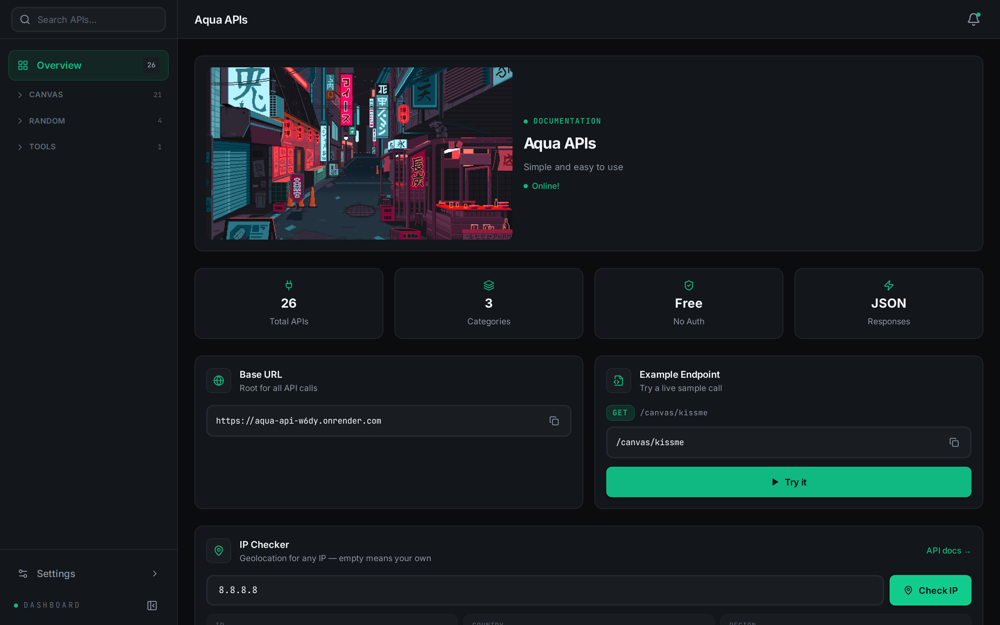

- **Stats** — Total APIs, Categories, Free/No-Auth, JSON responses.
- **Base URL** — copy button for the API root.
- **Example Endpoint** — one-click jump to a live sample call.
- **IP Checker** — enter any IP (empty = your own) → country, region, city, ISP,
  timezone. Same engine as `GET /tools/ipcheck?ip=`.
- **Response Format** — the envelope every response carries.
- **Error Codes** — 200 / 400 / 404 / 429 / 500 reference.
- **Categories** — tiles linking into each group.

Search the whole catalog from the sidebar — it filters as you type:

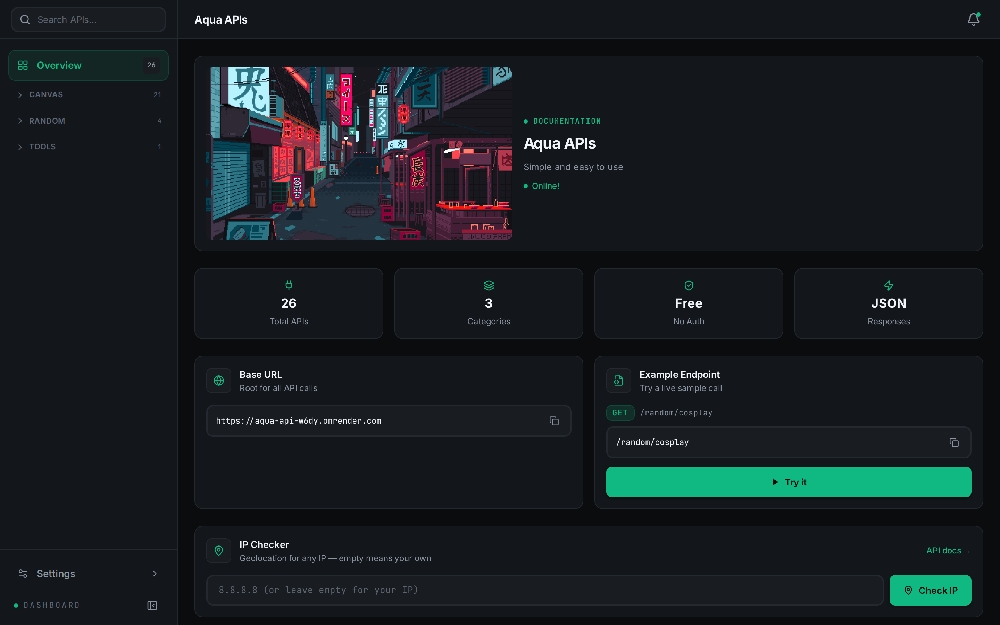

### 4.3 Endpoint pages (`/docs/:category/:name`)

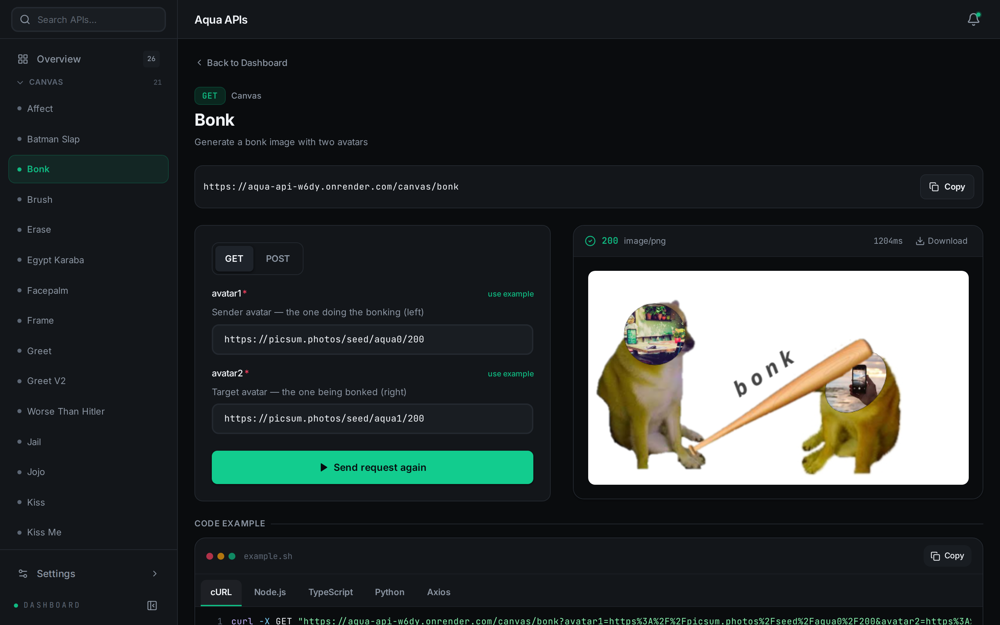

Each page shows the method badge, description, shareable URL (copy button),
parameter form (required-aware, conditional fields), **Send request** console
with status code, duration and pretty JSON / rendered image, plus **Code example**
tabs: **cURL, Node.js, TypeScript, Python, Axios**.

### 4.4 Themes

Sidebar → **Settings → Theme**: Aqua, Burnt, Indigo. Persisted in the browser.

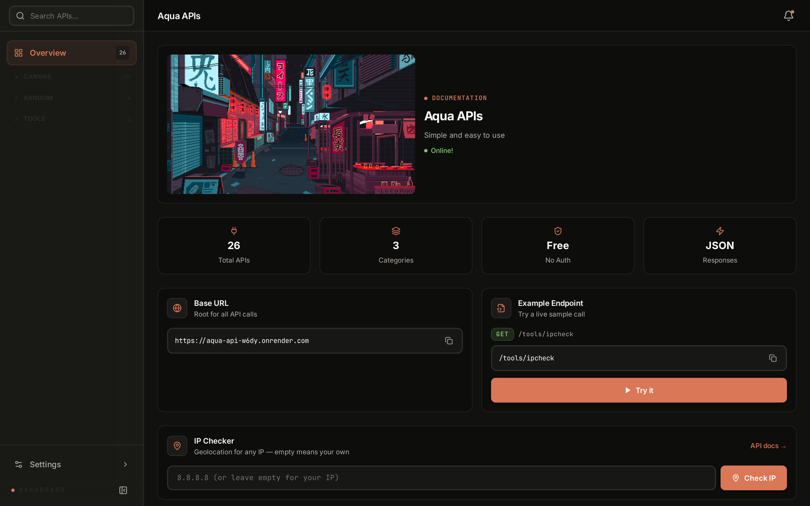
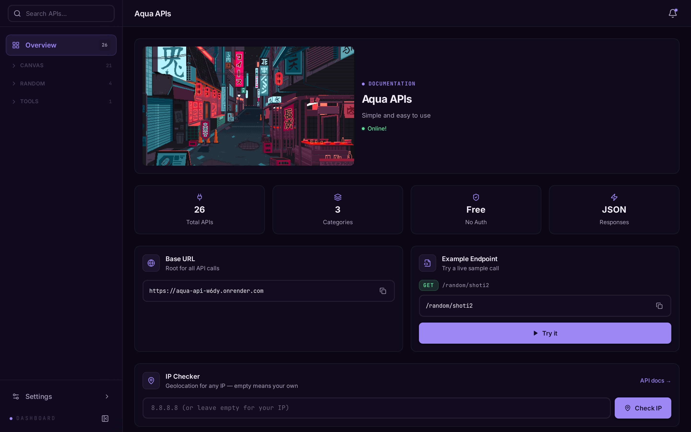

### 4.5 Not found

Unknown routes render a friendly 404 with a **Back home** button.

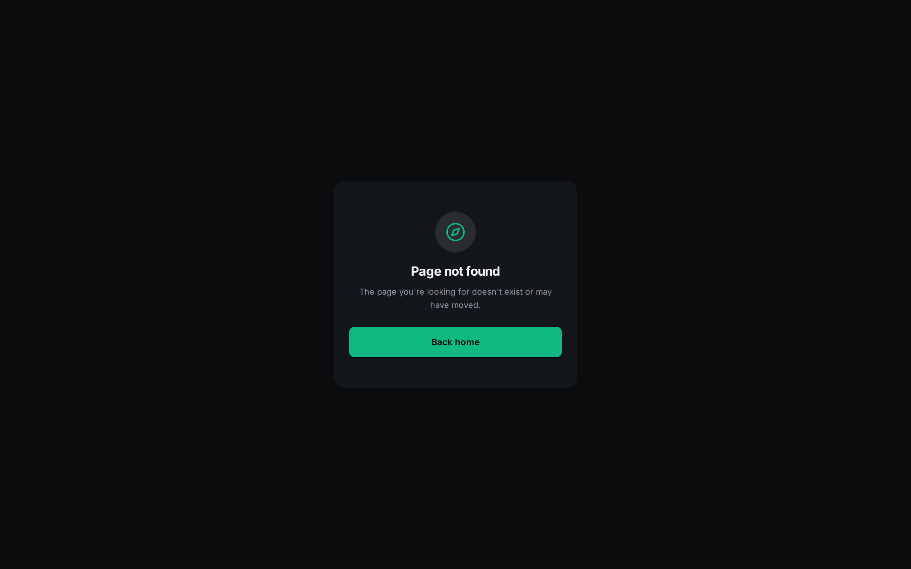

### 4.6 Mobile layout

Fully responsive: drawers replace sidebars, cards stack, consoles go full-width.

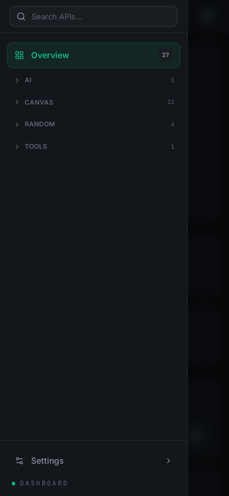
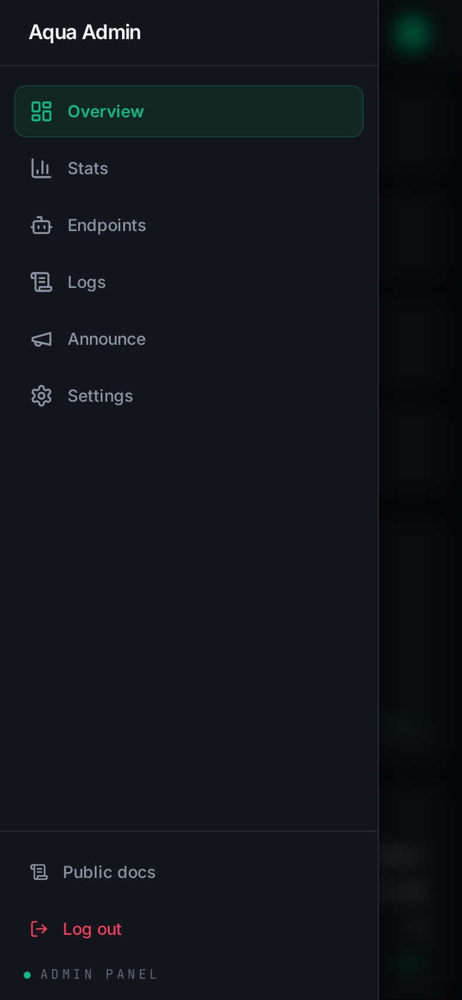

---

## 5. Endpoint catalog

Base URL: `/` (same origin). Every endpoint accepts `GET` and `POST` unless noted.
POST bodies are `application/x-www-form-urlencoded`. Try them all in `/docs`.

### Canvas — meme & card generator (images)

| Endpoint | Params |
|---|---|
| `/canvas/affect` | `image` |
| `/canvas/batslapt` | `image1`, `image2` |
| `/canvas/bonk` | `avatar1`, `avatar2` |
| `/canvas/brush` | `image` |
| `/canvas/delete` | `image` |
| `/canvas/egypt` | `image` |
| `/canvas/facepalm` | `image` |
| `/canvas/frame` | `image` |
| `/canvas/greet` · `/canvas/greet2` | `type`, `platform`, `avatar`, `background`, `backgroundUrl`, `backgroundTheme`, `username`, `serverName`, `message`, `memberCount`, `color` |
| `/canvas/hitler` | `image` |
| `/canvas/jail` | `image` |
| `/canvas/jojo` | `image` |
| `/canvas/kiss` · `/canvas/kissme` | `image1`, `image2` |
| `/canvas/rankup` · `/canvas/rankup2` | `platform`, `avatar`, `background`, `backgroundUrl`, `backgroundTheme`, `username`, `level`, `previousLevel`, `xpText`, `rank`, `color` |
| `/canvas/rip` | `image` |
| `/canvas/spank` | `image1`, `image2` |
| `/canvas/trash` | `image` |
| `/canvas/wanted` | `image` |

Image params accept URLs (or uploaded files in the docs console). `background=Dynamic`
pulls themed photos via Pixabay → Unsplash → Picsum fallback.

### Random — media (`GET`, except shoti/shoti2 which also take `POST`)

| Endpoint | Params | Notes |
|---|---|---|
| `/random/ba` | — | Random Blue Archive content |
| `/random/cosplay` | — | Random cosplay media |
| `/random/shoti` | `type` (`video`\|`photo`) | Random TikTok clip (needs `SHOTI_APIKEY` for full quota) |
| `/random/shoti2` | `option`, `url`, `password` | Gist-backed pool; `option=add` needs password (`API_KEY`) |

### AI

| Endpoint | Params | Notes |
|---|---|---|
| `/ai/lumenfall` | `prompt` (required), `size` | Needs `LUMENFALL_API`; may be disabled by admin when unconfigured (currently hidden) |

### Tools

| Endpoint | Params | Notes |
|---|---|---|
| `/tools/ipcheck` | `ip` (empty = caller) | IP geolocation (`ip/country/region/city/isp/timezone`) |

### Meta (`/api/*`)

| Endpoint | Notes |
|---|---|
| `GET /api/health` | Liveness probe (`{ status, health: "ok", uptime }`) |
| `GET /api/endpoints` | Full catalog (minus admin-disabled) powering the docs |
| `GET /api/config` | Site name/description/links + active announcements |
| `GET /api/notifications` | Announcement list (bell) |
| `POST /api/notification` | Publish (requires `API_KEY` in `Authorization`) |

---

## 6. Admin dashboard guide

Routes: `/admin` (login) → `/admin/dashboard` (overview, stats, endpoints, logs,
announce, settings). Bearer-token auth stored in `localStorage`; sessions are
validated against the server on load.

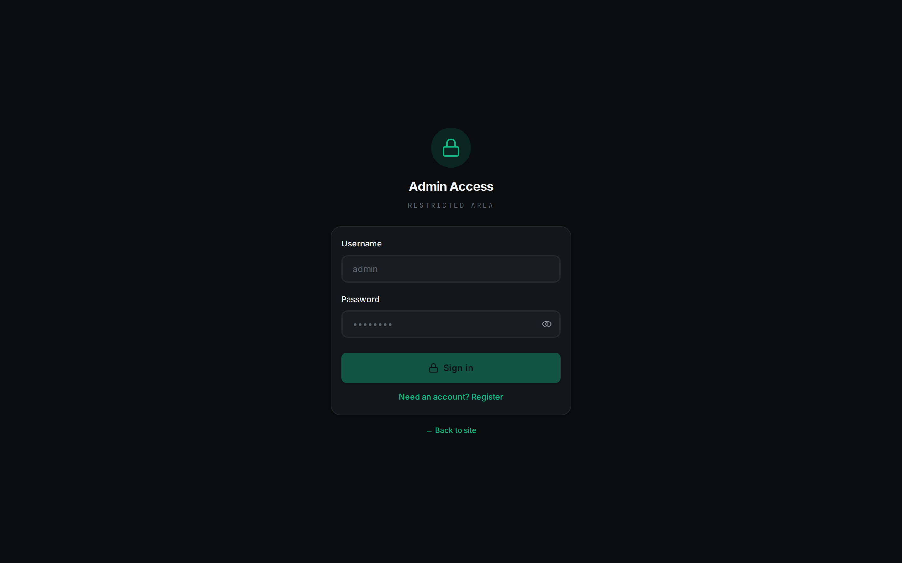

### 6.1 First run — Register

On `/admin`, switch to **Register** and fill username (3–32 chars:
lowercase/digits/`_`/`-`), password (min 8), and the **Setup key** = server
`API_KEY`. Passwords are stored as salted scrypt hashes only — they cannot be
recovered, only reset by deleting the admin row.

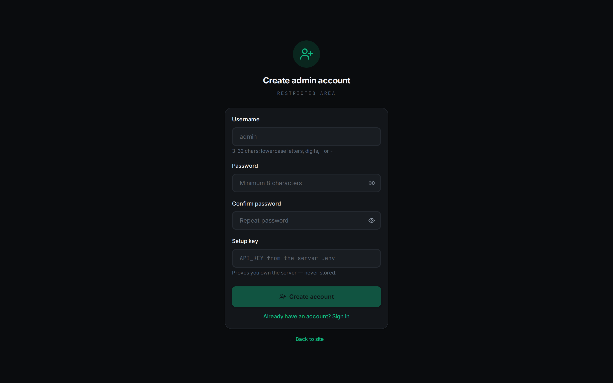

### 6.2 Overview (`/admin/dashboard`)

Cards for endpoints, 1h hits, uptime + heap, disabled/maintenance state; 24h
activity chart; system health (database adapter, memory, disabled count,
maintenance); recent warnings & errors.

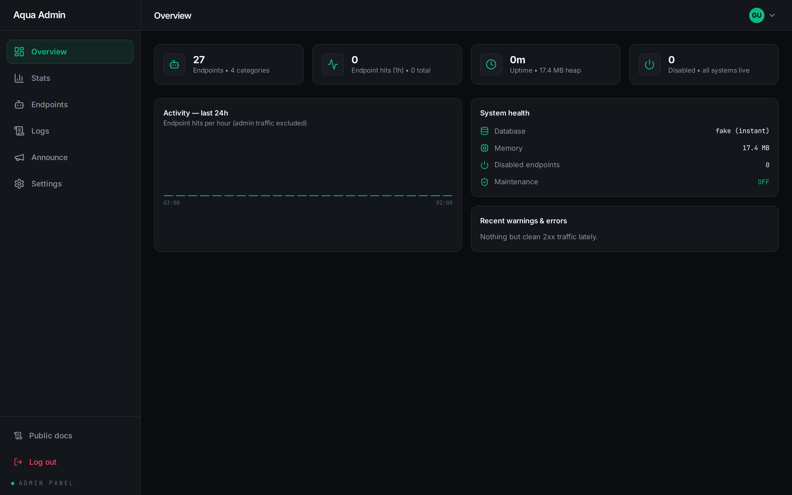

### 6.3 Stats (`/admin/dashboard/stats`)

Totals, error rate, requests/hour chart, traffic by source
(endpoint / api / admin / web), responses by status (2xx/4xx/5xx), platform info,
top routes with error counts.

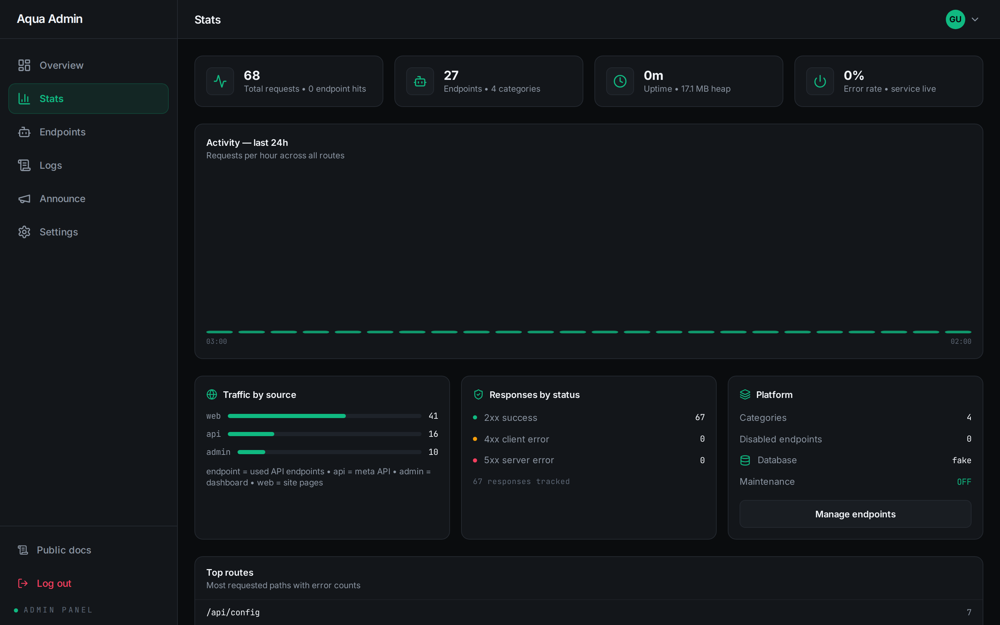

### 6.4 Endpoints (`/admin/dashboard/endpoints`)

Filter + per-endpoint **Enable/Disable** switch. Disabling answers `404`
immediately (and hides it from `/api/endpoints` + docs) — no restart.

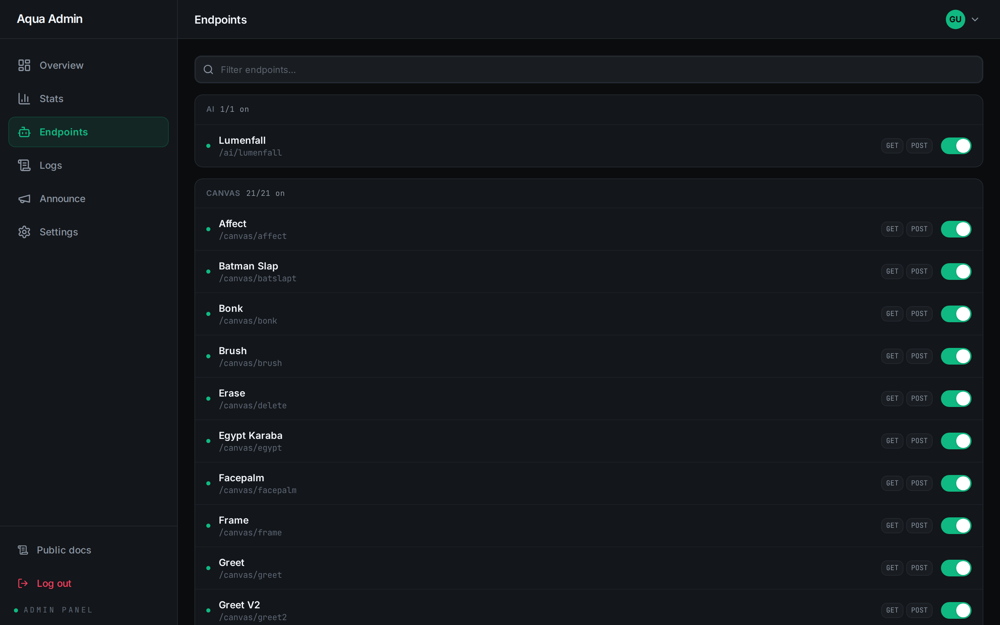

### 6.5 Logs (`/admin/dashboard/logs`)

Live request stream over SSE with **Pause/Resume** and **Live** toggle; filters by
text, level (info/warn/error) and source; per-row time, status badge, method,
path, duration; **Load older** paging.

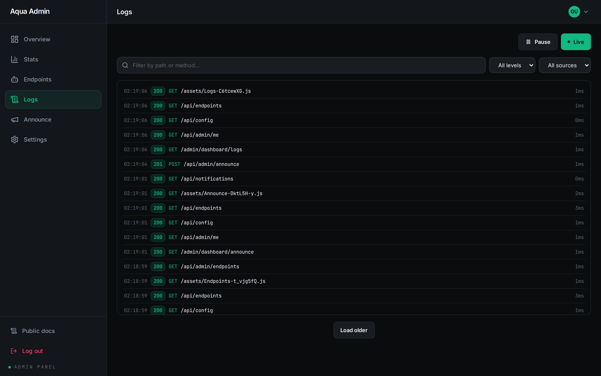

### 6.6 Announce (`/admin/dashboard/announce`)

Broadcast a title + message to every user's notification bell; live list with
relative times; **Clear all** (with confirmation dialog).

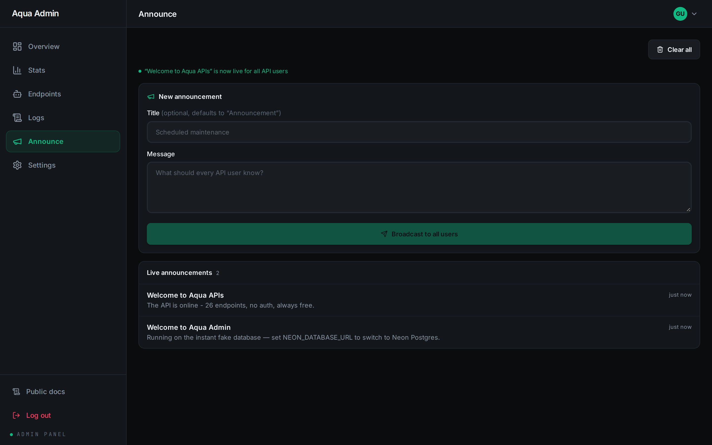

### 6.7 Settings (`/admin/dashboard/settings`)

Site profile (name, status line, description, Telegram/GitHub/Messenger) — live
immediately. **Maintenance mode** switch pauses the public API with `503` while
admin, `/api/health` and the site stay up. Read-only **API keys** inventory shows
which env keys are configured (previews only, never values).

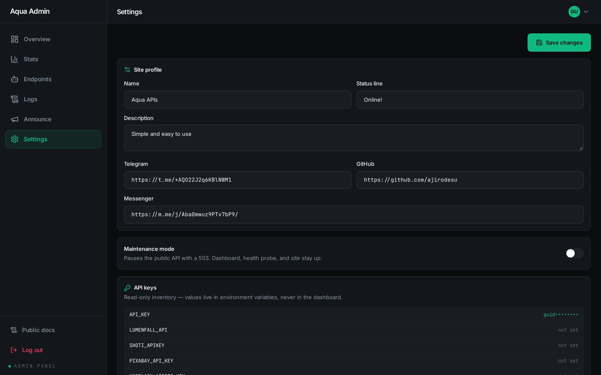

---

## 7. Database (fake vs Neon) + encryption

One interface, two adapters (`packages/aqua/src/db/`, same `pg`-Pool pattern as
Persian-Bot's neondb):

- **Fake (default):** memory + `packages/aqua/src/json/fakedb.json`. Zero setup,
  boots instantly, seeds a welcome notification. Shown as `fake (instant)` in admin.
- **Neon:** set `NEON_DATABASE_URL` (or `DATABASE_URL`) → real Postgres. Schema
  (`aqua_kv`, `aqua_notifications`, `aqua_admins`) auto-created at boot.
  Free project at `https://neon.tech`.

**Encryption at rest** (same layer as Persian-Bot): set `ENCRYPTION_KEY`
(`openssl rand -hex 32`) and `aqua_kv` values are stored AES-256-GCM encrypted
(`enc:v1:…` wire format, interoperable with Persian-Bot). Legacy plaintext rows
keep working; unset key = plaintext + one boot warning. Admin passwords are
separately scrypt-hashed and never encrypted.

---

## 8. Deploy to Render

1. Push this repo to GitHub (do **not** commit `.env`; **do** commit `package-lock.json`).
2. Create a **Web Service** (single service serves API + frontend + admin):
   - Build command: `npm install --include=dev && npm run build`
   - Start command: `npm start`
3. Environment: `NODE_ENV=production`, `API_KEY` (random secret — also the admin
   setup key), `NEON_DATABASE_URL` (or leave unset for fake DB), `ENCRYPTION_KEY`,
   plus any endpoint keys you use. Do **not** set `PORT` (Render injects it) and
   never set `NODE_ENV=development` here.
4. Deploy — open `/docs` and `/admin`, Register with the `API_KEY` as setup key.

> Why `--include=dev`: npm skips devDependencies when `NODE_ENV=production`,
> but `tsc` + `vite` are devDependencies needed to build. The flag installs them
> while `NODE_ENV=production` still produces the correct production bundle.

---

## 9. Troubleshooting

| Symptom | Cause → Fix |
|---|---|
| `Error loading bots / Couldn't load the API catalog: Failed to fetch` on a host, but `/api/*` works directly | Frontend bundle built with `NODE_ENV=development` → hardcoded `http://localhost:3000`. Set `NODE_ENV=production` + **rebuild** (Clear build cache & deploy) |
| Build fails: `TS7016 Could not find a declaration file for module 'react'` + hundreds of `TS7026` | DevDependencies skipped (`NODE_ENV=production` + plain `npm install`). Use build command `npm install --include=dev && npm run build` |
| First load slow / request hangs then works | Neon cold start (compute wake) or free-tier sleep. Wait for `Ready for connections`, refresh once |
| Public API returns `503` everywhere | Maintenance mode is ON (admin → Settings). Admin, `/api/health` and pages stay up by design |
| Endpoint returns `404` though it exists | Disabled in admin → Endpoints. Re-enable the switch |
| `/ai/lumenfall` missing / `500 missing credentials` | `LUMENFALL_API` unset (endpoint may be admin-disabled). Add the key, re-enable |
| `/random/shoti` rate-limited / 502 | `SHOTI_APIKEY` unset. Get one at `https://shoti.fbbot.org/myapikey` |
| `Frontend build not found` page | Host built the backend only. Build command must run root `npm run build` (web first, then aqua) |

---

## 10. Security notes

- Admin passwords: salted scrypt hashes (`admin-auth.ts`); timing-safe compare;
  dummy-hash check so unknown usernames take equal time.
- Admin API: Bearer token, `{ error }` failures, token-gated routes.
- Secrets stay server-side: Settings page shows key inventory previews only.
- DB settings encryptable at rest via `ENCRYPTION_KEY` (AES-256-GCM).
- `.env` is gitignored; `.env.example` documents every variable.

---

## 11. Project structure

```
Aqua-API/
├── GUIDE.md                  ← this file
├── README.md                 ← quick start + deploy summary
├── package.json              ← workspaces + root scripts (dev/build/start)
├── packages/
│   ├── aqua/                 ← Express backend (TypeScript)
│   │   └── src/
│   │       ├── engine/       ← app, env, crypto, admin router/store/auth, logs
│   │       ├── apis/         ← endpoint modules (ai/canvas/random/tools)
│   │       ├── db/           ← neon + fake adapters, shared interface
│   │       └── json/         ← config.json, fakedb.json (gitignored data)
│   └── web/                  ← React + Vite docs/admin frontend
│       └── src/
│           ├── pages/        ← Home, Docs*, admin/*
│           ├── components/   ← Sidebar, TopBar, ThemeToggle, AdminUI…
│           └── lib/          ← api client, appData, codeSnippets, theme
└── docs/screenshots/         ← images used in this guide
```

---

## 12. Screenshot index

All shots captured from the live deploy (`1440×900` @2x retina) and mobile
(`390×844` @2x); admin shots use an isolated demo account, so no real data is shown:

| File | Shows |
|---|---|
| `home.png` | Home: hero, categories, features, getting started |
| `docs-overview.png` | Docs: stats, base URL, IP checker result, reference |
| `docs-search.png` | Sidebar live search filtering |
| `endpoint-tryit.png` | Endpoint page: params, live result, code examples (single example: `/canvas/bonk`) |
| `docs-theme-burnt.png` / `docs-theme-indigo.png` | Burnt and Indigo themes |
| `admin-login.png` | Admin sign-in |
| `admin-register.png` | Admin registration + setup key |
| `admin-overview.png` | Dashboard overview cards + activity |
| `admin-stats.png` | Traffic stats + top routes |
| `admin-endpoints.png` | Endpoint kill switches |
| `admin-logs.png` | Live log stream + filters |
| `admin-announce.png` | Announcements broadcast |
| `admin-settings.png` | Settings + maintenance mode |
| `not-found.png` | 404 page |
| `home-mobile.png` | Home on mobile |
| `docs-mobile.png` | Docs on mobile (drawer open) |
| `endpoint-mobile.png` | Endpoint page on mobile |
| `admin-login-mobile.png` | Admin sign-in on mobile |
| `home-mobile.png` | Home on mobile |
| `docs-mobile.png` | Docs on mobile (drawer open) |
| `endpoint-mobile.png` | Endpoint page on mobile |
| `admin-login-mobile.png` | Admin sign-in on mobile |
| `admin-dashboard-mobile.png` | Admin dashboard on mobile (drawer open) |
